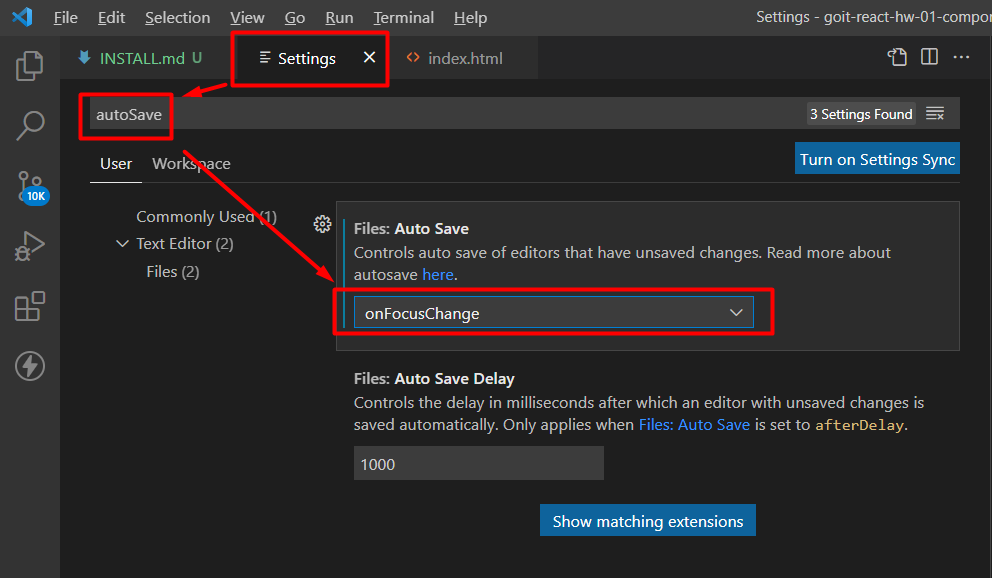
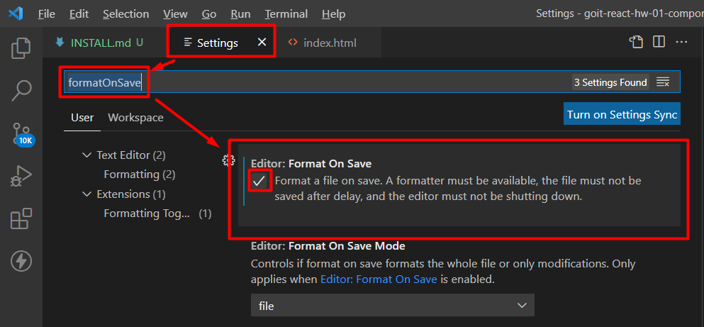
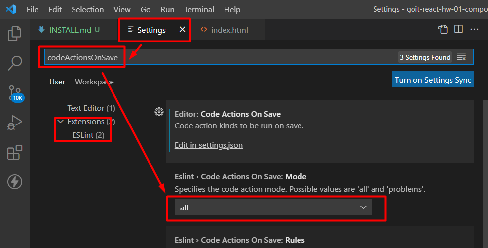

# Создание проекта на React

## 1. Создать репозиторий и склонировать на ПК

## 2. Установить React application

Открыть терминал в папке проекта и установить react-app

```powershell
npx create-react-app .
```

## Удалить ненужные файлы

В папке `public` оставить только `index.html`. Удалить код из `index.html`, создать базовую разметку
с помощью Emmet.

Разметка может выглядеть так:

```html
<!DOCTYPE html>
<html lang="en">
  <head>
    <meta charset="UTF-8" />
    <meta http-equiv="X-UA-Compatible" content="IE=edge" />
    <meta name="viewport" content="width=device-width, initial-scale=1.0" />
    <title>Document</title>
  </head>
  <body>
    <div id="root"></div>
  </body>
</html>
```

В папке `src` достаточно оставить `index.js`, `App.js`, `App.css`

В `index.js` достаточно оставить следующий код:

```js
// index.js
import React from 'react';
import ReactDOM from 'react-dom';
import App from './App';

ReactDOM.render(
  <React.StrictMode>
    <App />
  </React.StrictMode>,
  document.getElementById('root'),
);
```

В `App.js` достаточно оставить следующий код:

```js
// App.js
import './App.css';

function App() {
  return <div className="App">TEST</div>;
}

export default App;
```

В `App.css` удалить ненужные стили.

В папке `src` создать папку `components` для размещения будущих компонентов.

## Запустить сервер проверить, нет ли ошибкок.

```powershell
npm start
```

## Настройка pre-commit хуков

### 1 - Установка зависимосте

Установить в проект следующие пакеты.

`Примечание:` react-app корректно работает с более старой версией версией `eslint 7.11.0`

```powershell
npm install --save-dev prettier eslint@7.11.0
```

### 2 - Инициализация lint-staged и husky

ользователям `MacOS` и `Linux` систем необходимо выполнить в терминале следующую команду. Она
установит и настроит husky и lint-staged в зависимости от инструментов качества кода из зависимостей
проекта в package.json.

```powershell
npx mrm lint-staged
```

Пользователям `Windows` необходимо выполнить следующую команду. Она делает тоже самое.

```powershell
npx mrm@2 lint-staged
```

### 3 Настройка в VSCode

Провреить наличие следующих раширений:

`Prettier - Code formatter`

`Formatting Toggle`

`ESLint`

Можно добавить настройки `Prettier`, создав файл `.prettierrc.yaml` в корневой папке проекта. Можно
добавить следующие настройки.

```yaml
printWidth: 100
useTabs: false
semi: true
singleQuote: true
trailingComma: 'all'
bracketSpacing: true
arrowParens: 'avoid'
proseWrap: 'always'
```

Открыть настройки `VSCode` и проверить следующее:

`autoSave`



`formatOnSave`



`codeActionsOnSave`



Или же добавить код в файл `settings.json`

`Ctrl + Shift + P` => `settings.json` => `Open Settings (JSON)`

```json
{
  "files.autoSave": "onFocusChange",
  "editor.formatOnSave": true,
  "editor.codeActionsOnSave": {
    "source.fixAll.eslint": true
  }
}
```

## Настройка Деплоя

На компьютере должена быть установлена LTS-версия [Node.js](https://nodejs.org/en/) со всеми
дополнительными инструментами кроме **Chocolatey** - его ставить не нужно.

В

## Перед началом работы

Один раз на проект установить все зависимости.

```shell
npm ci
```

### Разработка

Запустить режим разработки.

```shell
npm run dev
```

Во вкладке браузера перейти по адресу [http://localhost:1234](http://localhost:1234).

### Деплой

Сборка будет автоматически собирать и деплоить продакшен версию проекта на GitHub Pages, в ветку
`gh-pages`, каждый раз когда обновляется ветка `main`. Например, после прямого пуша или принятого
пул-реквеста. Для этого необходимо в файле `package.json` отредактировать поле `homepage` и скрипт
`build`, заменив `имя_пользователя` и `имя_репозитория` на свои.

```json
"homepage": "https://имя_пользователя.github.io/имя_репозитория",
"scripts": {
  "build": "parcel build src/*.html --public-url /имя_репозитория/"
},
```

На всякий случай стоит зайти в настройки репозитория `Settings` > `Pages` и убедиться что продакшен
версии файлов раздаются из папки `/root` ветки `gh-pages`.

Через какое-то время живую страницу можно будет посмотреть по адресу указанному в отредактированном
свойстве `homepage`, например
[https://goitacademy.github.io/parcel-project-template](https://goitacademy.github.io/parcel-project-template).

## Файлы и папки

- Все паршалы файлов стилей должны лежать в папке `src/sass` и импортироваться в
  `src/sass/main.scss`
- Изображения добавляйте в папку `src/images`, заранее оптимизировав их. Сборщик просто копирует
  используемые изображения чтобы не нагружать систему оптимизацией картинок, так как на слабых
  компьютерах это может занять много времени.

  **Читать на других языках: [Русский](README.md), [Українська](README.ua.md).**

# Секция статистики

Создать компонет `<Statistics>`, который бы отображал статистику по переданным пропам. Например,
загрузки в облако по типу файлов, посещение веб-страницы пользователями разных стран, финансовые
траты и т. п. Данные о статистике лежат в файле [data.json](./data.json).


## Описание компонента

Компонент должен принимать два пропа `title` и `stats`, в которых указывается заголовок и объект
статистики.

- `title` - не обязателен, и если он не передан, не должна рендериться разметка заголовка `<h2>`.
- `stats` - массив объектов содержащих информацию о элементе статистики. Может иметь произвольное
  кол-во элементов.
- Цвет фона элемента статистики в оформлении можно пропустить, либо создать функцию для генерации
  случайного цвета.

Компонент должен создавать DOM элемент следующей структуры.

```html
<section class="statistics">
  <h2 class="title">Upload stats</h2>

  <ul class="stat-list">
    <li class="item">
      <span class="label">.docx</span>
      <span class="percentage">4%</span>
    </li>
    <li class="item">
      <span class="label">.mp3</span>
      <span class="percentage">14%</span>
    </li>
    <li class="item">
      <span class="label">.pdf</span>
      <span class="percentage">41%</span>
    </li>
    <li class="item">
      <span class="label">.mp4</span>
      <span class="percentage">12%</span>
    </li>
  </ul>
</section>
```

## Пример использования

```js
import data from '/путь/к/data.json';

<Statistics title="Upload stats" stats={data} />;
<Statistics stats={data} />;
```
